#  Agentic Socratic Peer Review

**A Multi-Agent System for Rigorous Research Idea Validation**

   

This project implements a **"Socratic Peer Review Ring"** where multiple AI agents, each with a distinct persona and goal, debate your research ideas in real-time. Instead of a simple "yes/no" feedback loop, the system simulates a rigorous academic defense to help you identify novelty, technical debt, and logical fallacies before you write a single line of code.

---

##  Architecture

The system uses a **Hub-and-Spoke** architecture managed by a Supervisor agent.

```mermaid
graph TD
    User([👤 User Input]) --> Supervisor{🧠 Supervisor}
    
    Supervisor -->|New Idea?| Novelty[🕵️ Novelty Detector]
    Supervisor -->|Fact Check| Librarian[📚 Librarian]
    Supervisor -->|Feasibility?| Auditor[⚙️ Methodology Auditor]
    Supervisor -->|Attack| Critic[👩‍⚖️ The Critic]
    Supervisor -->|Defend| Proponent[👷 The Proponent]
    
    Novelty -->|Report| Supervisor
    Librarian -->|Report| Supervisor
    Auditor -->|Report| Supervisor
    Critic -->|Rebuttal| Supervisor
    Proponent -->|Defense| Supervisor
    
    subgraph Tools
    Librarian -.-> ArXiv
    Librarian -.-> SemanticScholar
    Novelty -.-> ArXiv
    Novelty -.-> SemanticScholar
    end

```

##  The Agents

The system consists of six specialized agents, each with a distinct role and set of permissions:

* **Supervisor (The Router)**
    * **Role:** Analyzes the current state of the debate and determines which agent should speak next.
    * **Logic:** It enforces a "Hub-and-Spoke" workflow, ensuring that factual disputes are routed to the Librarian and logical fallacies are sent to the Critic.

* **Novelty Detector (The Gatekeeper)**
    * **Role:** Performs an initial scan to verify if the proposed idea has already been published.
    * **Tools:** ArXiv, Semantic Scholar.
    * **Goal:** To prevent the user from "reinventing the wheel" and force early differentiation from existing literature.

* **The Critic (Reviewer #2)**
    * **Role:** Relentlessly attacks the user's logic, identifies missing constraints, and highlights potential failure modes.
    * **Goal:** To simulate a harsh peer review process and expose weak arguments.

* **The Proponent (The Architect)**
    * **Role:** "Steel-mans" the user's concept. It proposes solutions to the Critic's attacks and pivots the idea to address flaws while maintaining the original vision.
    * **Goal:** To construct the strongest possible version of the research proposal.

* **The Librarian (The Researcher)**
    * **Role:** A purely objective agent that fetches live papers to verify claims or find prior art.
    * **Tools:** ArXiv, Semantic Scholar.
    * **Goal:** To ground the debate in reality and prevent hallucinated facts.

* **Methodology Auditor (The Engineer)**
    * **Role:** Ignores the abstract "vision" and focuses strictly on technical feasibility, including cost, latency, and computational complexity.
    * **Goal:** To flag "cool" ideas that are technically unbuildable or prohibitively expensive.

---

##  Screenshots

